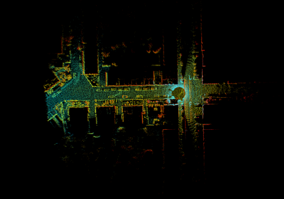

# LiDAR Weather-Fault Injection for Odometry Robustness

Bachelor-thesis code for evaluating how simulated fog and rain affect LiDAR
odometry. The canonical pipeline injects weather faults while KITTI scans are
loaded by KISS-ICP, then aggregates trajectory error with EVO.



## What this project is

This is **fault-injection and robustness-evaluation infrastructure**. It is not
an onboard fault detector, fault classifier, diagnostic monitor, or recovery
system.

```text
KITTI scan -> fog/rain injector -> modified KISS-ICP loader -> odometry
                                                        \-> EVO APE/RPE
batch runner --------------------------------------------> CSV summaries
```

The canonical fog model operates on XYZ point clouds. It probabilistically
selects returns as a function of range, deletes a subset, and moves the
remaining selected returns toward the sensor to model backscatter. It does not
apply intensity attenuation in the odometry pipeline.

## My thesis contribution

My work in this repository centers on:

- adapting the published Teufel et al. fog parameterization to an XYZ-only
  odometry path and developing the rain-model variant;
- injection hooks in the KISS-ICP KITTI data-loading path;
- parameter sweeps and fault statistics;
- EVO-based absolute and relative pose-error evaluation; and
- a separate experimental path for comparing simulated fog with real-fog MCAP
  recordings.

KISS-ICP, EVO, KITTI, and the underlying published fog-model parameterization
are external work. The repository adapts and integrates them for the thesis
experiments rather than claiming them as original components.

## Start here

| Path | Status | Purpose |
|---|---|---|
| `lidar-fault-localization_weather_faults/` | **Canonical** | Fog/rain injection, KISS-ICP integration, KITTI runs, EVO metrics, batch sweeps |
| `lidar-fault-localization_feature-mcap/` | Experimental | Simulated-vs-real fog analysis; requires MCAP recordings that are not public |
| `src/`, `configs/`, `testing/` | Legacy prototype | Early KITTI prototype retained for history; do not use as the primary pipeline |
| `tests/` | Portable | Synthetic, no-dataset smoke tests for the canonical fog injector |

The detailed weather-pipeline documentation is in
[`lidar-fault-localization_weather_faults/README.md`](lidar-fault-localization_weather_faults/README.md).
The MCAP subtree uses a separate, intensity-aware fog variant that is not used
by the KITTI odometry pipeline.

## Portable smoke test

The fault model can be checked without KITTI, KISS-ICP, or a GPU:

```bash
python3 -m venv .venv
source .venv/bin/activate
pip install numpy
python -m unittest discover -s tests -v
```

The test verifies deterministic seeded injection, the XYZ output contract, and
the injector's deletion statistics.

## Full KITTI pipeline

The automated setup script targets Linux and installs system build dependencies,
creates a Python environment, prepares KISS-ICP, and applies the local loader
modifications:

```bash
cd lidar-fault-localization_weather_faults
./setup.sh
source venv/bin/activate

# Baseline
lfl_pipeline --sequence 07 --data_root data/kitti --fault_model none

# Fog at 50 m visibility
lfl_pipeline --sequence 07 --data_root data/kitti \
  --fault_model fog --visibility 50

# Parameter sweep
python -m lfl.runner --fault_model fog \
  --sequence 07 --data_root data/kitti
```

Download KITTI odometry scans and poses separately and place them under
`lidar-fault-localization_weather_faults/data/kitti/` as described in the
pipeline README.

## Reproducibility boundaries

- KITTI data is not redistributed.
- Experiment outputs and benchmark figures are not committed, so this repository
  does not currently provide independently checkable performance numbers.
- The full build script is Linux-specific; the portable injector tests run
  independently of KISS-ICP.
- The MCAP validation path references private recordings and is not reproducible
  from this clone.
- Random seeds are supported by the fog model, but the main experiment CLI does
  not yet expose seed selection.

These limits are intentional to state plainly: the repository demonstrates the
implementation and evaluation pipeline, not a packaged benchmark result or a
fault-detection product.
